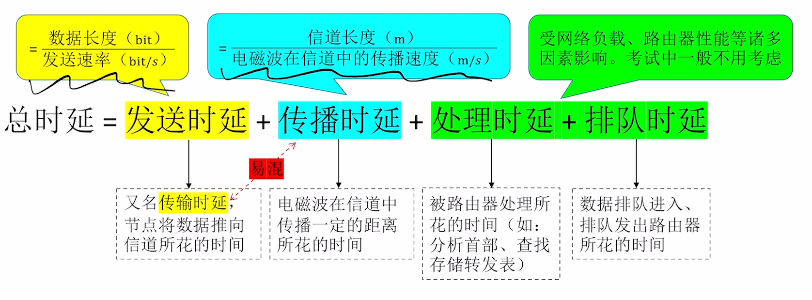
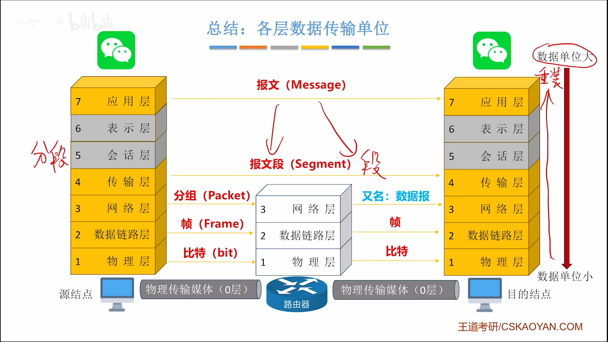
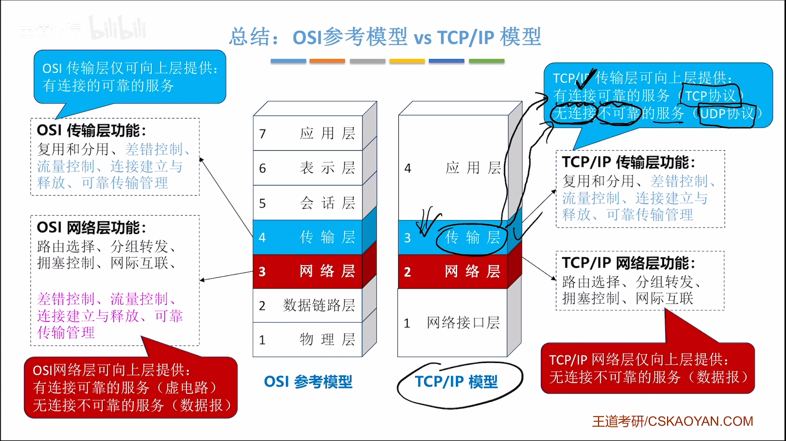
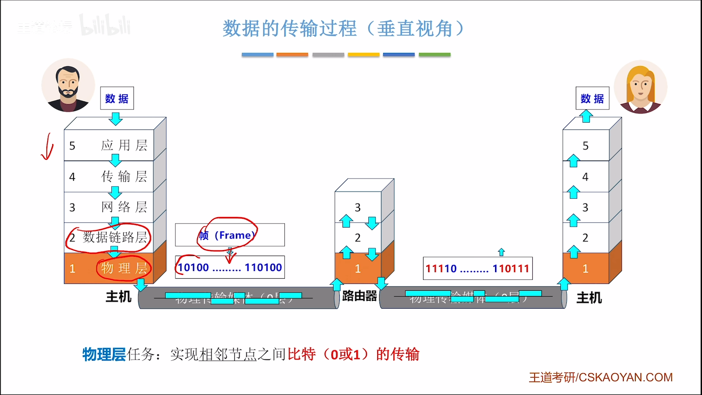

# 计算机网络
## [体系结构](#体系结构)
## [物理层](#物理层)
## 数据链路层
## 网络层
## 传输层
## 应用层

## 体系结构
通过计算机网络将*分散自治*的计算机链接起来
??定义区分：
- 计算机网络
- 互联网
- 互连网

**计算机网络**  ： 节点+链路
  ｜
  ｜  路由器链接
  v
**互连网**      ： 多个计算机网络连接起来
  ｜
  ｜  世界上最大规模的互连网
  v
**互联网**      ： Internet――由isp提供服务（电信联通）

tips：家用路由器 = 路由器+交换机+其他功能

### 交换技术
- 电路交换
- 报文交换
- 分组交换

*电路交换* ： 通信前建立链接，并且通信过程中双方会一直独占通信资源       但是1.会有额外的时间开销在建立链接上。 2.没有差错控制
*报文交换* ： 无需提前建立链接，存储转发，有校验；线路利用率高           但是：不定长，大报文会让内存变复杂，开销大，容易出错，代价高
*分组交换* ： 把报文分成多段，每个组有自己的首部信息来提供终点和顺序      但是：相对于点路交换有存储发送的时间延迟，容易有丢失
(**路由器**是一种典型的分组交换机)
*虚电路交换* ： 就是在*分组交换*的前提下，在开始前先模拟电路交换先建立链   但是：仍然有转发时延，且控制信息占比增加，复杂度也不低

### 计算机网络的性能指标
- 速率，带宽，吞吐量
- 时延，时延带宽积，往返时延
- 信道利用率

**速率** ： bps
**带宽** ： 某信道能传输的最高数据率，单位：bps
**吞吐量** ： 单位时间内通过某个网络的实际数据量――――>吞+吐，吞吐都要加在一起
**时延** ： 一端传输到另一端所需要的时间

**时延带宽积** ： 传播时延 * 带宽 = 已发出的但是未到达的最大比特数
**往返时延** ： 在发送端发送文件之后到收到确认信息的时间
**信道利用率** ： 信道有百分之多少的时间是在利用的（太低低效率，太高拥挤）

### OSI参考模型
*“物联网叔会使用”*

### TCP/IP模型

## 物理层
### 物理层的定义
物理层的主要作用就是实现相邻节点之间0和1的传输

### 信道基本概念
- 信源：
- 信号：
- 信道：
- 码元：
- 速率：
